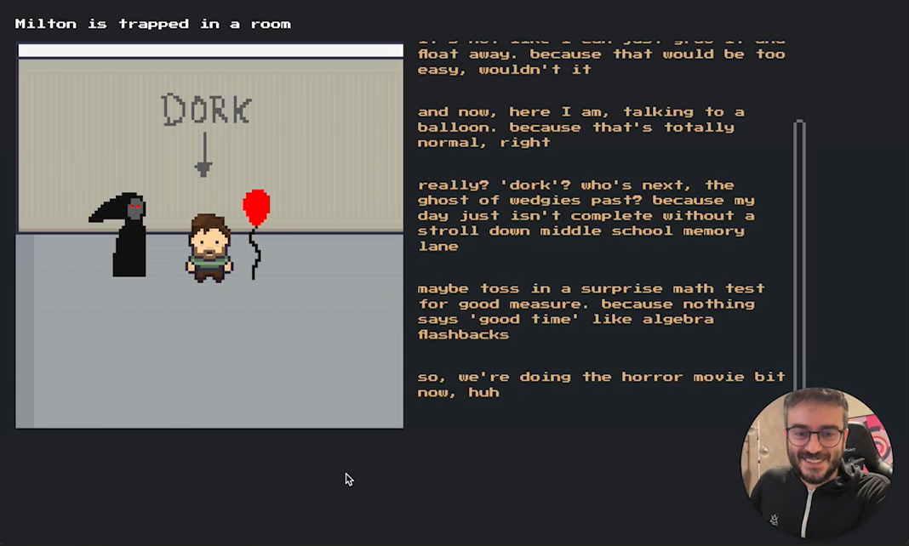

# Milton - A sandbox for digital life trapped in a room

This is an exploration of digital life inhabiting interactive environments.

## How to run

1. Make sure you have node and bun installed
1. Get access to the [Soul Engine](https://docs.souls.chat/)
1. `cd` into `soul` and run `npx soul-engine dev`
1. Configure the app by creating the file `app/src/.tokens.json` (using `tokens.sample.json` as a reference)
1. Run the app - `cd` into `app` and run `npm i && npm run dev`
1. Configure the voice app by creating `voice/.env` (using `env.sample` as a reference)
1. Run the voice app - `cd` into `voice` and run `bun i && bun ./src/index.ts`

## Assets used in the game

- Room: https://limezu.itch.io/ (Modern interiors)
- Character: https://rcpstd.itch.io/ (Interior Tileset Asset Pack)
